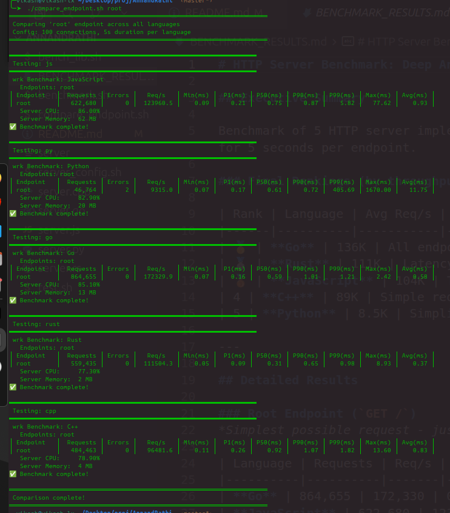
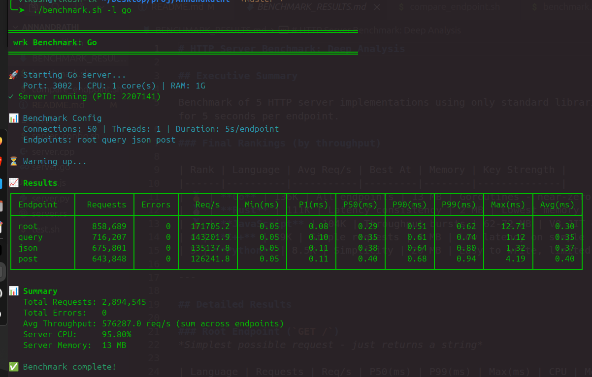

# ⚡ HTTP Server Benchmark

> **Performance comparison of minimal HTTP servers in JavaScript, Python, Go, Rust, and C++ — using only standard libraries.**

A fair, apples-to-apples comparison of how different programming languages handle HTTP requests when constrained to their standard libraries only. No frameworks, no external dependencies.

---

## 📊 Benchmark Results

### Performance Comparison (100 connections, 5 seconds)



### Detailed Benchmark Output



### Summary Table

| Rank | Language | Requests/sec | P50 Latency | Memory | Key Strength |
|:----:|----------|-------------:|------------:|-------:|--------------|
| 🥇 | **Go** | 172,330 | 0.59ms | 13 MB | Goroutines - near-zero overhead |
| 🥈 | **JavaScript** | 123,961 | 0.75ms | 62 MB | V8 JIT optimization |
| 🥉 | **Rust** | 111,504 | 0.31ms | 2 MB | Lowest latency & memory |
| 4 | **C++** | 96,482 | 0.92ms | 4 MB | Direct system calls |
| 5 | **Python** | 9,315 | 0.61ms | 20 MB | GIL limited |

> 📖 **[See BENCHMARK_RESULTS.md](BENCHMARK_RESULTS.md) for detailed analysis and insights**

---

## 🚀 Quick Start

### Prerequisites

```bash
# Ubuntu/Debian
sudo apt install nodejs python3 golang-go rustc g++ wrk curl

# macOS
brew install node python go rust wrk
```

### Run Benchmarks

```bash
# Clone the repository
git clone https://github.com/yourusername/http-server-benchmark.git
cd http-server-benchmark

# Test all servers work correctly
./test.sh

# Benchmark a specific language
./benchmark.sh -l go

# Compare all languages on an endpoint
./compare_endpoint.sh root 100 5
```

---

## 📁 Project Structure

```
.
├── servers/                    # Server implementations
│   ├── server.js              # JavaScript (Node.js event loop)
│   ├── server.py              # Python (ThreadingMixIn)
│   ├── server.go              # Go (goroutines)
│   ├── server.rs              # Rust (thread pool)
│   └── server.cpp             # C++ (thread pool)
├── benchmark.sh               # Main benchmark tool
├── bench_lib.sh               # Benchmark library (wrk wrapper)
├── server_config.sh           # Server configuration
├── test.sh                    # Functional test suite
├── compare_endpoint.sh        # Compare languages on endpoint
├── result_images/             # Benchmark screenshots
├── BENCHMARK_RESULTS.md       # Detailed analysis
└── README.md
```

---

## 🔧 API Endpoints

All servers implement identical endpoints:

| Endpoint | Method | Description |
|----------|--------|-------------|
| `/` | GET | Returns hello message |
| `/something?params` | GET | Query parameter parsing |
| `/something?json=true` | GET | Returns JSON response |
| `/something` | POST | Echoes request body as JSON |

### Examples

```bash
# Simple GET
curl http://localhost:3000/
# → Hello from JavaScript!

# Query parameters
curl "http://localhost:3002/something?name=test&value=123"
# → Route: /something, Query: {name: test, value: 123}

# JSON response
curl "http://localhost:3002/something?json=true"
# → {"route":"/something","query":{"json":"true"}}

# POST with body
curl -X POST http://localhost:3003/something \
  -H "Content-Type: application/json" \
  -d '{"hello":"world"}'
# → {"route":"/something","body":{"hello":"world"}}
```

---

## 📈 Benchmark Tool

### Usage

```bash
./benchmark.sh -l <language> [OPTIONS]
```

### Options

| Flag | Description | Default |
|------|-------------|---------|
| `-l, --lang` | Language: `js`, `py`, `go`, `rust`, `cpp` | required |
| `-e, --endpoint` | Endpoint: `root`, `query`, `json`, `post`, `all` | `all` |
| `-c, --connections` | Concurrent connections | `50` |
| `-d, --duration` | Test duration (seconds) | `5` |
| `--cpu` | CPU cores for server | `1` |
| `--mem` | Memory limit | `1G` |

### Examples

```bash
# Quick test
./benchmark.sh -l go

# High-load test
./benchmark.sh -l js -c 200 -d 10

# Single endpoint
./benchmark.sh -l rust -e root -c 100

# With resource limits
./benchmark.sh -l py --cpu 2 --mem 2G

# Compare all languages
./compare_endpoint.sh root 100 5
./compare_endpoint.sh post 100 5
```

---

## 🏗️ Concurrency Models

| Language | Model | Implementation | Stack Size |
|----------|-------|----------------|------------|
| **Go** | Goroutines | M:N scheduling | ~2KB |
| **JavaScript** | Event Loop | Single-threaded async | Minimal |
| **Rust** | Thread Pool | 8 workers + mpsc | ~16MB total |
| **C++** | Thread Pool | 8 workers + mutex | ~16MB total |
| **Python** | Threading | OS threads + GIL | ~2MB/thread |

---

## 🔍 Key Insights

### Why Go Wins
- **Goroutines**: 1000x lighter than OS threads (~2KB vs ~2MB)
- **M:N Scheduling**: Runtime manages goroutines efficiently
- **Built-in HTTP**: Production-grade, highly optimized

### Why Rust Has Best Latency
- **No GC**: Zero garbage collection pauses
- **Zero-cost abstractions**: Compile-time optimizations
- **Lowest memory**: Only 2MB footprint

### Why JavaScript is Competitive
- **V8 JIT**: Compiles to optimized machine code
- **Event loop**: No context switching overhead
- **Mature runtime**: Years of production optimization

### Why Python is Slowest
- **GIL**: Only one thread runs Python code at a time
- **Interpreted**: No JIT compilation
- **Thread overhead**: OS threads with GIL contention

> 📖 **[Full analysis in BENCHMARK_RESULTS.md](BENCHMARK_RESULTS.md)**

---

## 📋 Server Ports

| Language | Port | Run Command |
|----------|------|-------------|
| JavaScript | 3000 | `node servers/server.js` |
| Python | 3001 | `python3 servers/server.py` |
| Go | 3002 | `go run servers/server.go` |
| Rust | 3003 | `rustc -O servers/server.rs -o server && ./server` |
| C++ | 3004 | `g++ -O3 servers/server.cpp -o server && ./server` |

---

## 🛠️ Requirements

### Languages
- Node.js 14+
- Python 3.7+
- Go 1.16+
- Rust 1.50+
- g++ or clang++ with C++17

### Tools
- `wrk` - HTTP benchmarking tool
- `curl` - HTTP client (for testing)

### Optional
- `systemd-run` - For CPU/memory limits (Linux only)

---

## 🤝 Contributing

To add a new language:

1. Create `servers/server.{ext}` implementing the 4 endpoints
2. Add configuration to `server_config.sh`
3. Test with `./test.sh`
4. Benchmark with `./benchmark.sh -l <lang>`
5. Submit a PR!

---

## 📄 License

MIT License - Feel free to use and modify for your own comparisons.

---

<p align="center">
  <b>⭐ Star this repo if you found it useful!</b>
</p>
